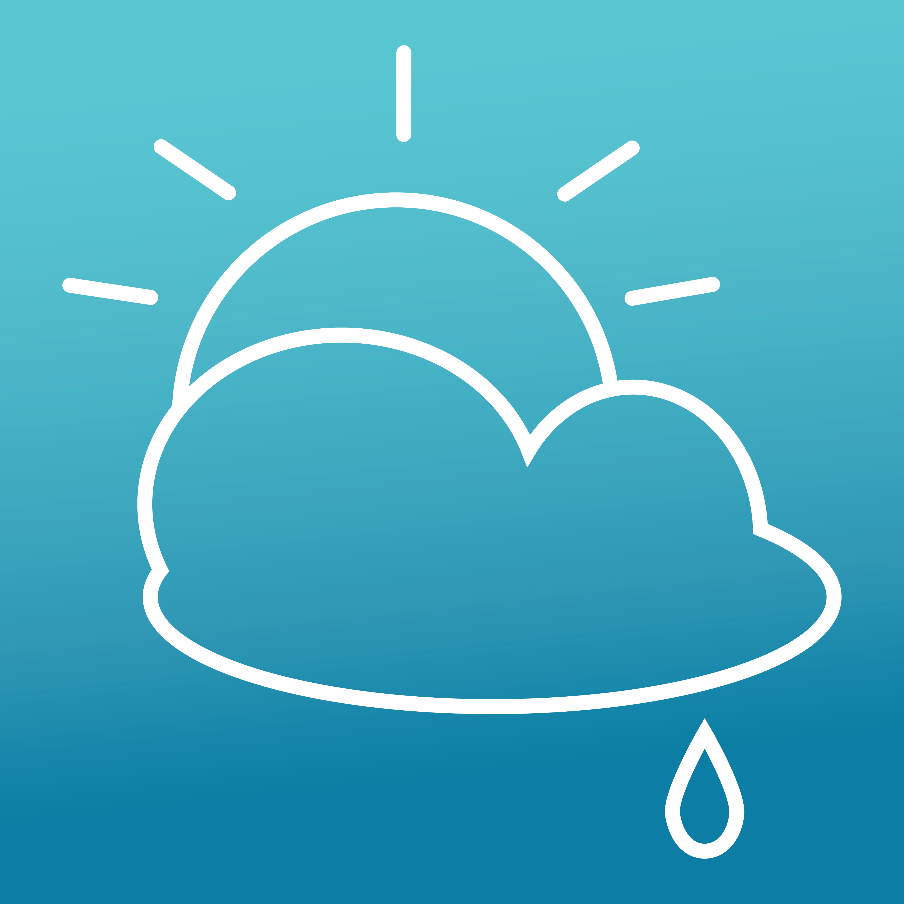
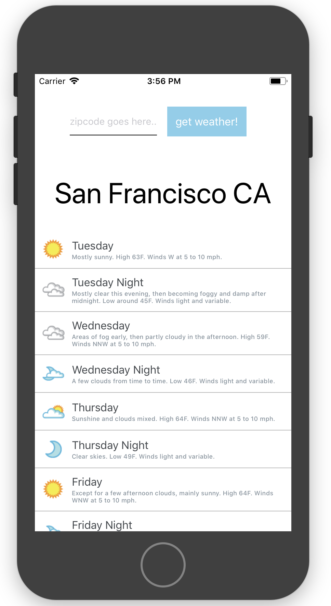

 

Forecast is a mobile app that, on load, displays a user's local three-day forecast using their location. A user can get the forecast for other destinations using the zipcode search feature.

Access the app [here](https://expo.io/@danielleletarte/forecast) on Expo (you will need an Expo account to run it).

 

Forecast uses the [Weather Underground API](https://www.wunderground.com/weather/api/d/docs?d=index).

This project was bootstrapped with [Create React Native App](https://github.com/react-community/create-react-native-app).

